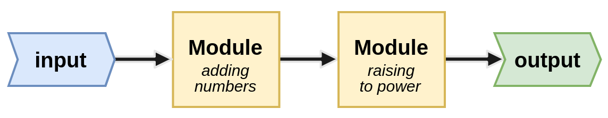
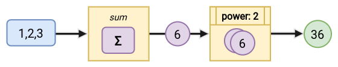

# MAGDA :girl: 

*MAGDA* is a Python library intended for **assembling a stream-like architecture** of an application following functional programming principles, by **using predefined interfaces and classes**. *MAGDA* stands for Modular and Asynchronous Graphs with Directed and Acyclic edges, and is the backbone of the library.   

The library works best when the code can be split into independent operations with clearly defined input and outputs. The main idea is to use *MAGDA* to **process code in a sequential flow**. Think of this as nodes with input/output as edges in directed graphs.

*MAGDA* supports the following operations:  
&nbsp;&nbsp;&nbsp;&nbsp; :building_construction: &nbsp; building an application pipeline from a configuration file and from code,  
&nbsp;&nbsp;&nbsp;&nbsp; :clock4: &nbsp; asynchronous and synchronous processing,   
&nbsp;&nbsp;&nbsp;&nbsp; :scissors:	&nbsp; dividing modules into groups for the asynchronous pipeline,   
&nbsp;&nbsp;&nbsp;&nbsp; :dart:	&nbsp; aggregation of partial results.

*MAGDA* can be applied almost anywhere but is especially well-suited for BigData parallel processing and ML pipelines intended for carrying out multiple, repeatable experiments.

| :open_book: &nbsp; Read more in the documentation on the [Github Wiki](https://github.com/NeuroSYS-pl/magda/wiki). |
| :---: |


## Installation

###### pip
```
pip install magda
```

###### From the repository
```bash
pip install https://github.com/NeuroSYS-pl/magda/archive/main.zip
```

## Quickstart
Having installed *MAGDA*, a simplistic pipeline can be created with just a few lines of code.



The above pipeline is composed of just 2 modules. The first one sums all numbers from a given list and outputs a single number. And the second module raises that number to a given power.

There can be implemented **several approaches to building the same pipeline**. 

### 1. The simplest `SequentialPipeline`
Every pipeline consists of a couple of steps:
1. Class definition - defining each `Module` (and `Interface`)
2. Module initialization - getting every `Module` instance, defining its dependencies and parameters
3. Pipeline creation - defining a pipeline and adding `Modules` to it
4. Pipeline build
5. Pipeline run



```python
import asyncio
from magda.module import Module
from magda.decorators import accept, finalize, expose
from magda.pipeline import SequentialPipeline


@finalize
class AddingNumbersModule(Module.Runtime):
    def run(self, data, request):
        return sum(request)

@accept(AddingNumbersModule)
@expose()
@finalize
class RaisingToPowerModule(Module.Runtime):
    def run(self, data, **kwargs):
        number = data.get(AddingNumbersModule)
        return number ** self.parameters['power']


sum_module = AddingNumbersModule('module_sum')
power_module = RaisingToPowerModule('module_power')
power_module.depends_on(sum_module)
power_module.set_parameters({'power': 2})

builder = SequentialPipeline()
builder.add_module(sum_module)
builder.add_module(power_module)

runtime = asyncio.run(builder.build())
result = asyncio.run(runtime.run(request=[1, 2, 3]))
print(result['module_power'])
# output: 36
```

### 2. `SequentialPipeline` with Interfaces
*MAGDA* Interfaces are just classes encapsulating data passed between modules. However, it's recommended to use them as they straighten the code up, providing more clarity and flexibility. 

The above code can be rewritten as follows:

```python
import asyncio
from dataclasses import dataclass
from magda.module import Module
from magda.decorators import accept, produce, finalize, expose
from magda.pipeline import SequentialPipeline


@dataclass
class Number(Module.Interface):
    value: int

@dataclass
class Power(Module.Interface):
    number: int
    power: int = 1


@produce(Number)
@finalize
class AddingNumbersModule(Module.Runtime):
    def run(self, data, request):
        return Number(sum(request))

@accept(Number)
@produce(Power)
@expose()
@finalize
class RaisingToPowerModule(Module.Runtime):
    def run(self, data, **kwargs):
        number = data.get(Number).value
        power = self.parameters['power']
        return Power(number ** power, power=power)


sum_module = AddingNumbersModule('module_sum')
power_module = RaisingToPowerModule('module_power')
power_module.depends_on(sum_module)
power_module.set_parameters({'power': 2})

builder = SequentialPipeline()
builder.add_module(sum_module)
builder.add_module(power_module)

runtime = asyncio.run(builder.build())
result = asyncio.run(runtime.run(request=[1, 2, 3]))
print(result['module_power'])
# output: Power(number=36, power=2)
```

### 3. `SequentialPipeline` built from a config file
It's also recommended to use configs - `yaml` files that enable to define a pipeline easily. The *Pipeline creation* and *Pipeline build* steps are now replaced by registering `Modules` in the `ModuleFactory` and reading the pipeline from a configuration file.  

The same pipeline as before can be obtained using the below config:

###### my_config_file.yaml
```yaml
modules:
  - name: module_sum
    type: adding-numbers-module
  - name: module_power
    type: raising-to-power-module
    depends_on:
      - module_sum
    parameters:
      power: 2
```

```python
import asyncio
from dataclasses import dataclass
from magda.module import Module
from magda.decorators import accept, produce, finalize, expose
from magda.pipeline import SequentialPipeline
from magda.module.factory import ModuleFactory
from magda.config_reader import ConfigReader


@dataclass
class Number(Module.Interface):
    value: int

@dataclass
class Power(Module.Interface):
    number: int
    power: int = 1


@produce(Number)
@finalize
class AddingNumbersModule(Module.Runtime):
    def run(self, data, request):
        return Number(sum(request))

@accept(Number)
@produce(Power)
@expose()
@finalize
class RaisingToPowerModule(Module.Runtime):
    def run(self, data, **kwargs):
        number = data.get(Number).value
        power = self.parameters['power']
        return Power(number ** power, power=power)


ModuleFactory.register('adding-numbers-module', AddingNumbersModule)
ModuleFactory.register('raising-to-power-module', RaisingToPowerModule)

with open('my_config_file.yaml') as file:
    config = file.read()
    runtime = asyncio.run(ConfigReader.read(config, ModuleFactory))

result = asyncio.run(runtime.run(request=[1, 2, 3]))
print(result['module_power'])
# output: Power(number=36, power=2)
```

## License
Distributed under the [Apache-2.0 License](LICENSE).
